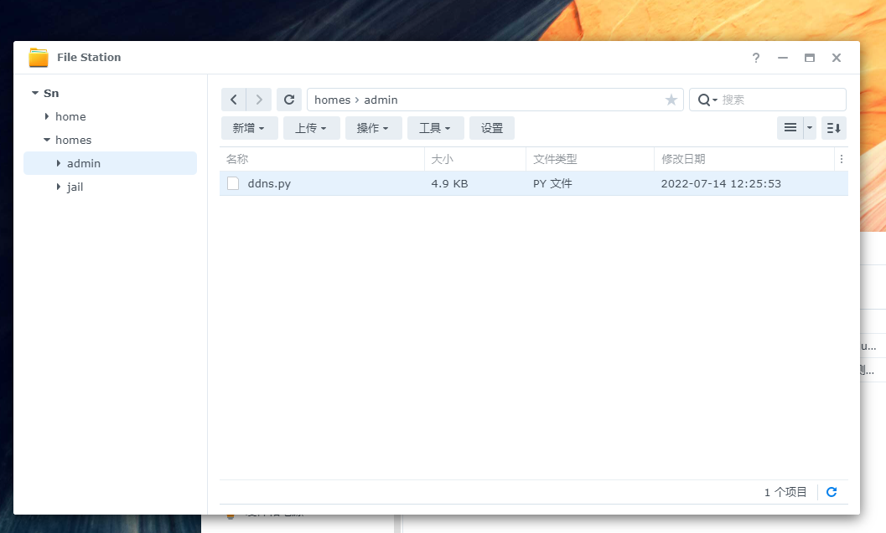
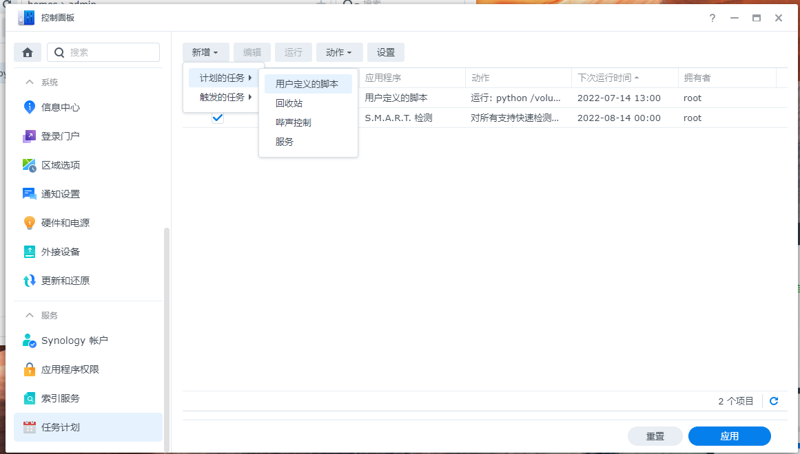
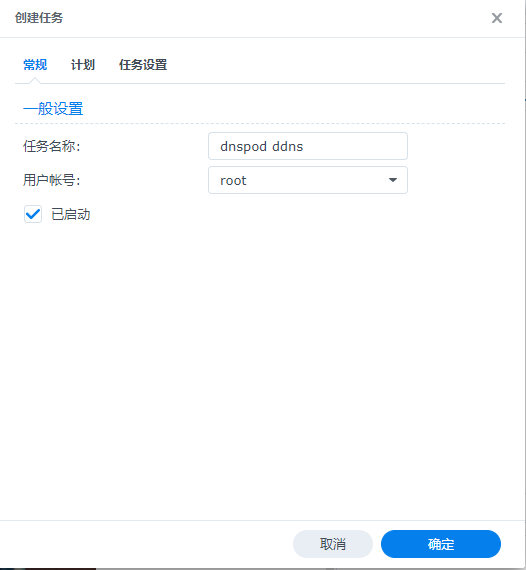
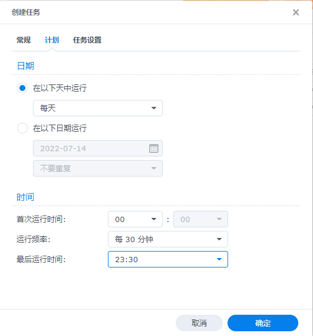
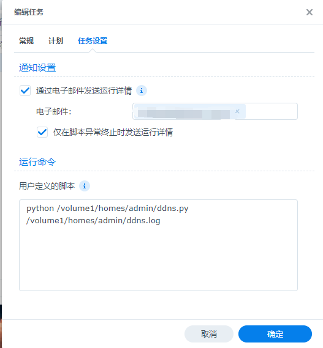
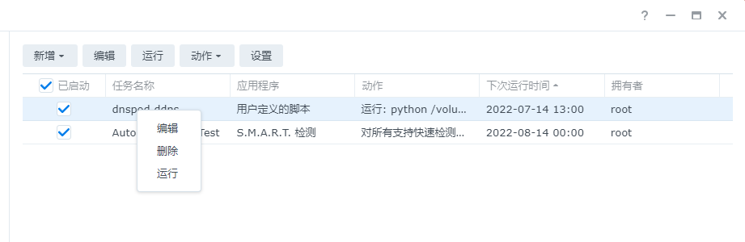

# DdnsUp
### DDNS 自动更新脚本,使用python3.9编写,适合没有docker的nas等用户. 
### 支持Ipv4、Ipv6.
## 1、登录Dnspod获取Token和Id
    使用dnspod官方教程获取Token和Id
    https://docs.dnspod.cn/account/dnspod-token/
## 2、下载依赖
使用ssh工具进入群晖或其他nas系统输入：

    pip3 install requests

根据自己python版本选择pip,群晖系统需要另外安装pip

群晖安装命令：

    sudo python -m ensurepip
    sudo python -m pip install --upgrade pip

执行完毕检查版本：

    sudo pip -V
    
## 3、下载脚本并填写对应参数
    下载 ddns.py 放入nas中

    进入 控制面板 新增 用户定义的脚本

    设置用户为 root

    计划 根据自己实际情况为准, 我个人设置为30分钟一次.

  

    用户脚本设置：

    python /volume1/homes/admin/ddns.py /volume1/homes/admin/ddns.log

    根据自己实际路径做改变
    

## 4、运行
    
    右键任务选择 运行 进行测试

