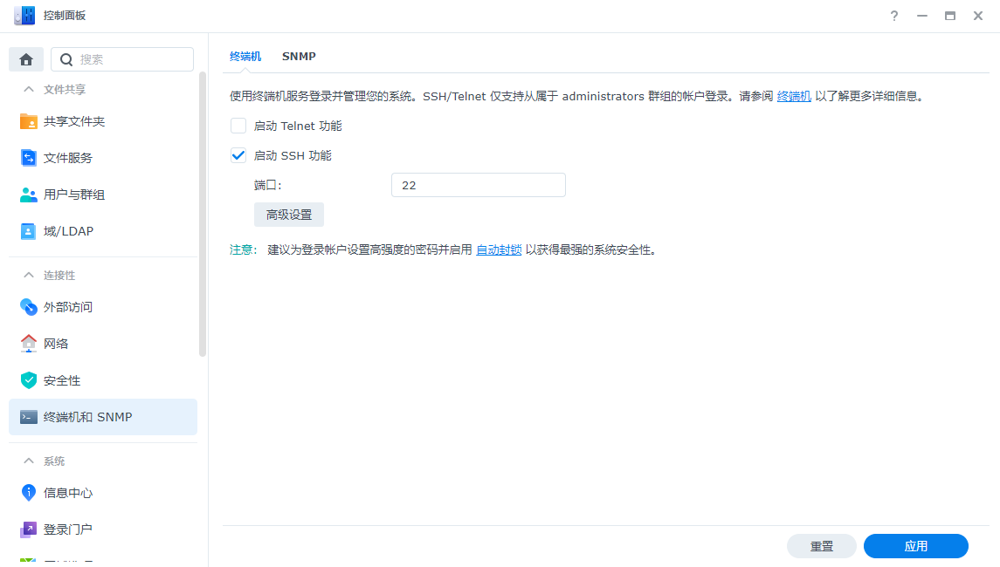
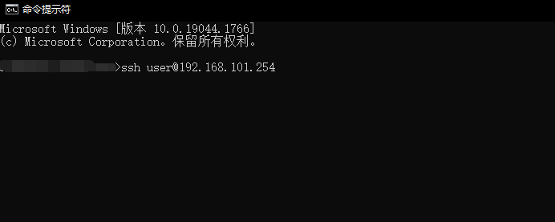
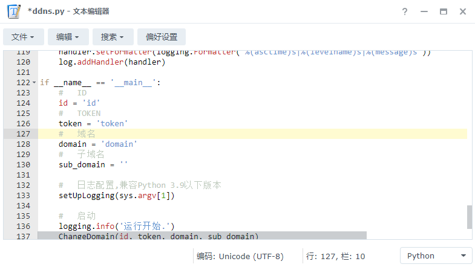

# DdnsUp
### DDNS 自动更新脚本,使用python3.9编写,适合没有docker的nas等用户. 
### 支持Ipv4、Ipv6.
## 1、登录Dnspod获取Token和Id
    使用dnspod官方教程获取Token和Id
    https://docs.dnspod.cn/account/dnspod-token/
## 2、下载依赖

开启ssh:

使用ssh工具进行链接：

    这里我使用的是windows10自带的cmd
    ssh user@ip
    user为你账户名
    回车后输入你的密码

群晖安装命令：
    
    注意：执行命令后会让你输入密码,密码就是你的账户密码.
    sudo python -m ensurepip
    sudo python -m pip install --upgrade pip

执行完毕检查版本：

    sudo pip -V

使用pip安装依赖
    
    sudo pip install requests
    
## 3、下载脚本并填写对应参数
    下载 ddns.py 放入nas中

    进入 控制面板 新增 用户定义的脚本

    设置用户为 root

    计划 根据自己实际情况为准, 我个人设置为30分钟一次.

  

    用户脚本设置：

    python /volume1/homes/admin/ddns.py /volume1/homes/admin/ddns.log

    根据自己实际路径做改变
    

    根据名称填写相对应参数, 建议使用子域名

## 4、运行
    
    右键任务选择 运行 进行测试

